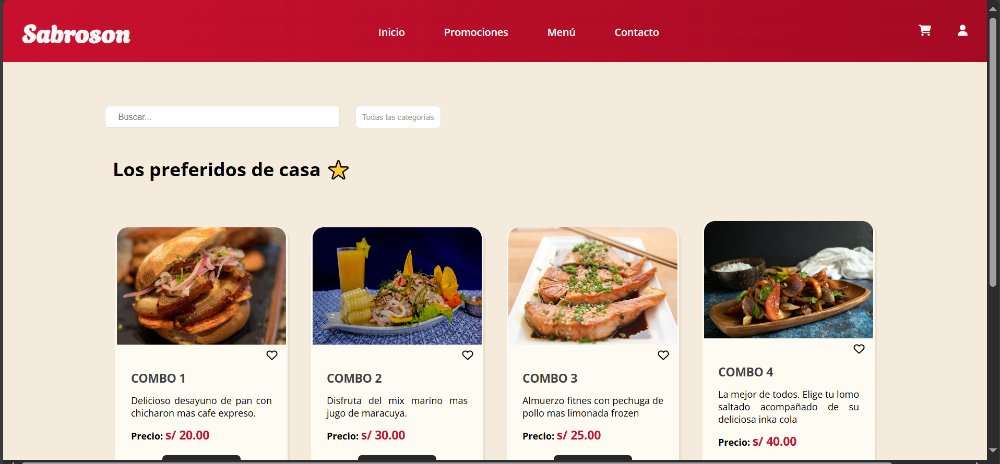

# DISEÑO Y ESTILOS

#🍔 Sabroson - Market de comida en Línea 🍟

Sabroson es una página web estática diseñada para simular un market de comida en línea . Su objetivo es presentar combos de alimentos caseros de forma atractiva, organizada y funcional, destacando los productos favoritos de los clientes.🌟

## 📸 Vista previa del proyecto:

La pagina cuenta con una estructura  que incluye

---

## 🚀 Características principales:
1. **Navbar fija* con links especifico. 
El navbar ocupa el 100% de la página y esta con una posición fija. Ya que el usuario puede scrollear y mantener las ocpciones del menu a la vista. 

2. Iconos proximamente interactivos y funcionales.
Carrito de compras.
Perfil de usuario.

3. La sección de búsqueda y categorías, permite a los usuarios buscar productos o filtrar por categorías como Desayunos y Almuerzos.

4. **Catálogo de productos:**
- Las cards estan formadas por su título descripcion,precio y el corazon para añadirlo como favorito. Ademas de tener un boton de (agregar al carrito )con efecto hover y zoom.

5. El footer también tiene estilo minimalista, con enlaces a redes soicales, la marca y los derechos reservados.

## 🛠️ Tecnologías utilizadas:

El diseño solo utiliza **HTML5** y **CSS3**
- **HTML5**: Estructura del proyecto.
- **CSS3**: Estilos y diseño visual.
  - Uso de **Flexbox** para el layout.
  Efectos hover en elementos interactivos.
- **Font Awesome**: Iconos personalizados.

