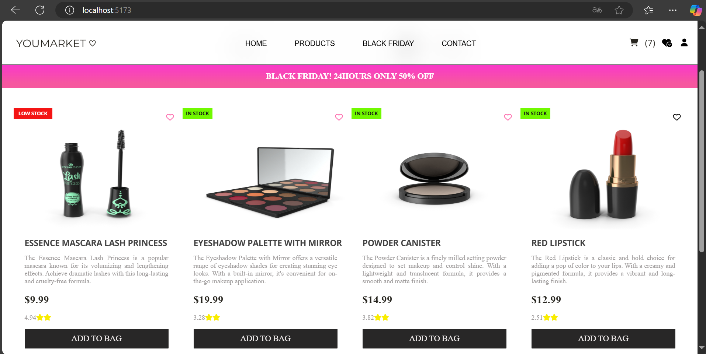
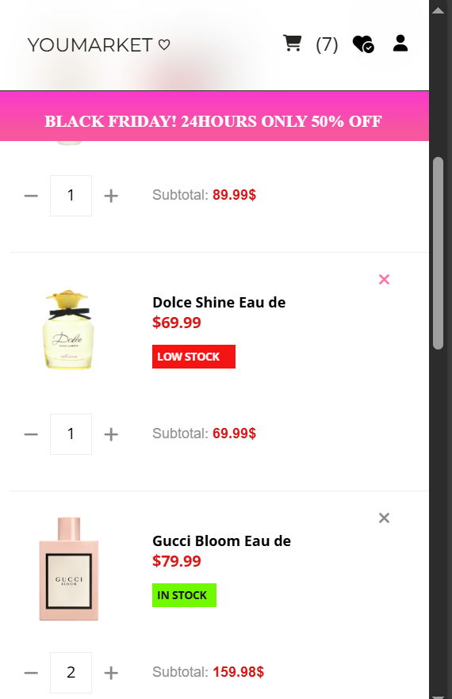
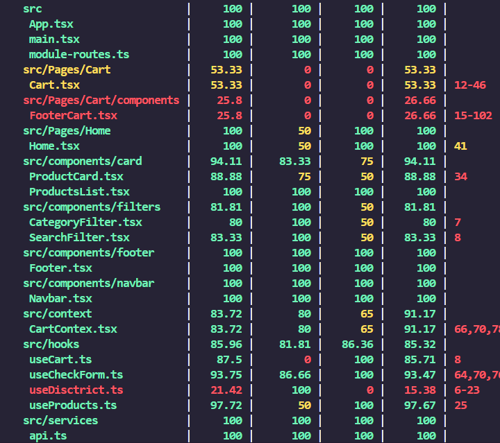

## Pruebas Unitarias 

## YOUMARKET♡ 💄🛒

Se realizó una iteración  completamente diferente del  market anterior. Esta vez tenemos el YOUMARKET♡ , una tienda en linea
lo cual podrás realizar tus compras fácilmente, podrás agregar como favorito, filtrar por categorias o por producto en especifico. 

## 📸 Vista previa del proyecto desktop:


## 📸 Vista previa del proyecto mobile:


## 🛠️ Migración a React con typescript

Este proyecto ha sido migrado  de `Javascript vanilla` a ` React con typescript` se ha componetizado el código y separado la lógica de negocio, se ha creado cada carpeta y archivo necesario para separar responsabilidades ademas de volverlo reutilizable y practico al momento de realizar los test.


Las principales características de React que se han integrado incluyen:

- **Componentes**: Creados especificamente para cada sección, como el header, navbar, footer..entre otros, lo cual solo contienen eventos y jxs. En caso se requiera agregar componentes "atomos" o "moleculas" *(siguiendo el sistema de diseño)* se  podrá añadir facilmente ya que cada uno tiene su propia carpeta.
- **Hooks**: Se utilizan hooks como useState y useEffect para manejar el estado y los efectos secundarios de la aplicación de forma más eficiente.
- **Props**: Uso de props en componentes, como `productCard.tsx` que recibe datos de productos, como el *title, description, price, rating etc*.
- **React-router-dom**: Se instalo router-dom para la navegacion de páginas, para este proyecto es necesario navegar hasta la vista del carrito para visualizar el resume de tus compras. 

## 💻 Uso de useState

Se utilizó `useState`para:
 - Visibilidad de productos.
 - Productos visibles *(Solo muestra los primeros 4 productos)*
 - Botón de mostrar todos los productos
 - Filtrado del buscador.
 - Desplegable por categoria.
 - El contador del carrito
 - El boton de favoritos.
 - Un loading antes de mostrar los productos. 
 - Formulario con los datos del usario para el envio de productos.

## 💻 Uso de useEffect
Se utilizó `useEffect` para 

- Cargar y mostrar los productos utilizando la `Fetch API` el hook se ejecuta una vez al montar al componente para realizar la llamada al servicio y actualizar el estado de los productos.
- Guardar el estado del carrito en el localStorage y recuperar los datos almacenados cuando la página se recarga.
- Lectura de un archivo Json que contiene los distritos en el formulario.

## 💻 Uso de useContext
Se utilizó `useContext` para 
- Crear un contexto global llamado CartContext que permite compartir el estado del carrito entre componentes.


## 🔰 Características principales:

- `Carrito de compras:` 
  1. Incrementa dinámicamente el contador de productos al agregar productos al carrito. 
  2. Se puede navegar a la vista del carrito (Cart) donde se pueden visualizar los productos seleccionados.
  3.Cada producto cuenta con botones para incrementar y decrementar la cantidad, además de la opción para eliminar el producto del carrito.
  4. El precio total se actualiza automáticamente en función de las cantidades seleccionadas.
- `Formulario de compras:`Se añadió un formulario que se debe completar con los datos del usuario para realizar la compra.
- `Favoritos:` Permite marcar productos como favoritos. `Lógica pendiente`
- `Perfil de usuario:` Función en desarrollo.
- `Buscador: `
  1. Permite realizar una búsqueda de productos a través de la caja de busqueda.
  2. La búsqueda se realiza en las propiedades `title`, `description`, `price`, y `rating` de los productos.
  3. El filtro de búsqueda no es sensible a mayúsculas/minúsculas.
- `Desplegable de categorías: `Se añadió un menú desplegable `<select>` con las categorías que escogí de la API. 
- `Diseño responsive: `
  1. Compatible con dispositivos móviles, tablets y desktops.
  2. Usé Media Queries en CSS para personalizar estilos en distintos breakpoints.
  3. Utilicé Flexbox para una estructura flexible y adaptable de cada elemento.


## 🔧 Herramientas utilizadas 

| Tecnología     | Uso                                 |
|-------------   |-------------------------------------|
| **HTML**       | Estructura base del proyecto        |
| **CSS**        | Estilo visual y diseño responsive   |
| **Flexbox**    | Organización de elementos           |
| **JavaScript** | Funciones                           |
| **modules**    | import y export                     |
| **React**      | Hooks, componentes,react-router-dom |
| **Typescript** | Tipado estático                     |
|**localStorage**| Mantiene los datos en el carrito    |
|**Font Awesome**| Iconos personalizados.              |
|**Google Fonts**| Fuentes personalizadas.             |


## 📁 Esctructura  de carpetas y archivos 

- `project-market/`
  - `public/`
  - `src/`
    - `assets/`
    - `components/`
      - `card/`
        - `ProductCard.tsx`
        - `ProductList.tsx`
        - `cardStyle.css`
      - `filters/`
        - `CategoryFilter.tsx`
        - `SearchFilter.tsx`
        - `filterStyle.css`
      - `footer/`
        - `Footer.tsx`
      - `navbar/`
        - `Navbar.tsx`
        - `navbarStyle.css`
      - `context/`
        - `CartContext.tsx`
        - `reducer.ts`
      - `domain/`
        - `Product.ts`
        - `cart-typr.ts`
      - `hooks/`
        - `useProduct.ts`
        - `useCart.ts`
        - `useCheckForm.ts`
        - `useDistrict.ts`
      - `Pages/`
        - `Cart/`
         - `components/`
          - `FooterCart.tsx`
          - `FooterStyle.css`
         - `Carts.tsx`
         - `CartStyle.css`
        - `Home/`
          - `Home.tsx`
          - `homeStyle.css`
      - `services/`
        - `api.ts`
      - `state/`
        - `Categories.ts`
        - `ProductState.ts`
      - `utils/`
        - `filterCategory.ts`
      - `App.tsx`
      - `main.tsx`
      - `module-routes.ts`
      - `style.css`
  - `index.html`
  - `package.json`


## 🌵 Ramas del proyecto
  
  ```
   feature/diseño-y-estilos 
   feature/javaScript 
   feature/typescript  
   feature/react-fundamentos
   feature/react-implementacion
   feature/pruebas-unitarias
  ```


## Pruebas Unitarias - coverage 

La cobertura de pruebas está en progreso. Continuaré trabajando en ello para asegurarme de que el proyecto esté completamente al 100%
Se muestra un resumen de la cobertura de pruebas:




## 📋 Instalación 
  ```
1. Clona el repositorio:
  
  git clone https://github.com/Valmontx/BOOTCAMP-FRONTEND-REACT-NTT.git

2. Ingresa a la carpeta
   cd project/market 

3. Inicia el servidor 
   npm run dev 

4. Rama en la que se está trabajando
   git checkout feature/pruebas-unitarias
  
   ```
 

## Créditos
- Proyecto desarrollado como parte del bootcamp **NTT DATA**.

