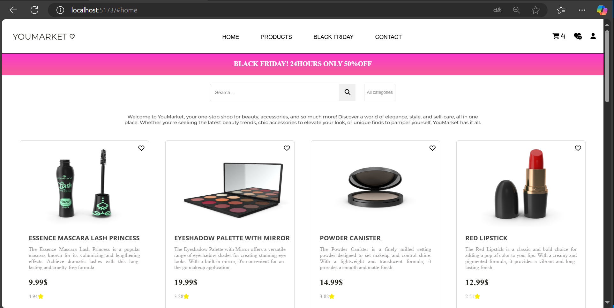

## JavaScript

## YOUMARKET♡ 💄🛒

Se realizo una iteración  completamente diferente del  market anterior. Esta vez tenemos el YOUMARKET♡ , una tienda en linea, lo cual podrás realizar tus compras fácilmente , podrás filtrar por categorias o por producto en especifico. Además puedes agregar como favorito el producto antes de agregarlo al carrito.  

## 📸 Vista previa del proyecto:

La pagina cuenta con una estructura  que incluye:

## 🔰 Características principales:

- **Carrito de compras:**  Incrementa dinámicamente el contador de productos al agregar productos al carrito.
- **Favoritos:**  Permite marcar productos como favoritos. `Lógica pendiente`
- **Perfil de usuario:**  Función en desarrollo.
- **Buscador:** 
 - Permite realizar una búsqueda de productos a través de la caja de busqueda (`<input>` con id `search-products`).
 - La búsqueda se realiza en las propiedades `title`, `description`, `price`, y `rating` de los productos.
 - El filtro de búsqueda no es sensible a mayúsculas/minúsculas.
- **Desplegable de categorías:** 
 - Se añadió un menú desplegable `<select>` con las categorías que escogí de la API. 
 - Creé una función que se ejecuta en el evento change del `<select>`, filtrando los productos con base en la categoría seleccionada.
- **Diseño responsive:**  
 -  Compatible con dispositivos móviles, tablets y desktops.
 -  Usé Media Queries en CSS para personalizar estilos en distintos breakpoints.
 -  Utilicé Flexbox para una estructura flexible y adaptable de cada elemento.

## 🔧 Herramientas utilizadas 

| Tecnología     | Uso                                 |
|-------------   |-------------------------------------|
| **HTML**       | Estructura base del proyecto        |
| **CSS**        | Estilo visual y diseño responsive   |
| **Flexbox**    | Organización de elementos           |
| **JavaScript** | Funcionalidades dinámicas del sitio |
|**Font Awesome**| Iconos personalizados.              |
|**Google Fonts**| Fuentes personalizadas.             |

## 📁 Esctructura  de carpetas y archivos 

├─project-market/               
│ ├─src/ 
│ | ├──assets/            
│ | ├──index.js                 
│ │ └──filter.js
│ │ └──shopping-cart.js
│ │ └──style.css
│ ├──index.html  
│ ├──package.json      
│ └──vite.config.js

## 🌵 Branches

- `feature/diseño-y-estilos`
- `feature/javaScript`

## Roadmap

- [x]  consumo de APIS.
- [x]  Desplegable de categrías funcional.
- [x]  Caja de búsqueda funcional. 
- [x]  Incrementa el "0" en agregar al carrito. 

## 📋 Instalación 

1. Clona el repositorio:
   `git clone https://github.com/Valmontx/BOOTCAMP-FRONTEND-REACT-NTT.git`
2. Ingresa a la carpeta
   `cd project/market `
3. Inicia el servidor 
   `npm run dev` 
4. Rama en la que se está trabajando
   `git checkout feature/javaScript `  

## Créditos
- Proyecto desarrollado como parte del bootcamp **NTT DATA**.

